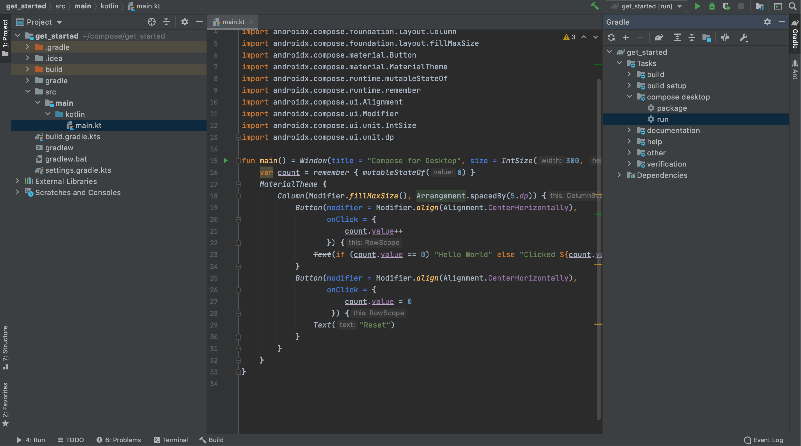

# Getting Started with Compose for Desktop

## What is covered

In this tutorial we will see how to create and deploy simple desktop UI application
using Compose UI framework.

## Prerequisites

 Compose for Desktop can produce applications for macOS, Linux and Windows platforms,
and all those three platforms could be used for running this tutorial.

Following software have to be preinstalled:
   * JDK 11 or later
   * IDEA Community or Ultimate 20.2 or later (other editors could be used, but we assume IDEA in this tutorial)

## Creating a new project

*TBD: new project wizard*

Recommended way of building Compose for Desktop projects is using Gradle.
JetBrains provides a convenient way of building Compose for Desktop project
using special Gradle plugin.
First create a new directory, named `sample`.
```shell script
mkdir sample
cd sample
```

Create `settings.gradle.kts` as following:
```kotlin
pluginManagement {
    repositories {
        gradlePluginPortal()
        maven("https://maven.pkg.jetbrains.space/public/p/compose/dev")
    }
}
```
Then create `build.gradle.kts` with the following content:
```kotlin
import org.jetbrains.compose.compose

plugins {
    kotlin("jvm") version "1.4.0"
    id("org.jetbrains.compose") version "0.1.0-dev68"
    application
}

repositories {
    jcenter()
    maven("https://maven.pkg.jetbrains.space/public/p/compose/dev")
}

dependencies {
    implementation(compose.desktop.all)
}

application {
    mainClassName = "MainKt"
}
```
Then create file `src/main/kotlin/main.kt` and put there:
```kotlin
import androidx.compose.desktop.Window
import androidx.compose.foundation.Text
import androidx.compose.foundation.layout.Arrangement
import androidx.compose.foundation.layout.Column
import androidx.compose.foundation.layout.fillMaxSize
import androidx.compose.material.Button
import androidx.compose.material.MaterialTheme
import androidx.compose.runtime.mutableStateOf
import androidx.compose.runtime.remember
import androidx.compose.ui.Alignment
import androidx.compose.ui.Modifier
import androidx.compose.ui.unit.IntSize
import androidx.compose.ui.unit.dp

fun main() = Window(title = "Compose for Desktop", size = IntSize(300, 300)) {
    var count = remember { mutableStateOf(0) }
    MaterialTheme {
        Column(Modifier.fillMaxSize(), Arrangement.spacedBy(5.dp)) {
            Button(modifier = Modifier.align(Alignment.CenterHorizontally),
                   onClick = {
                       count.value++
                   }) {
                Text(if (count.value == 0) "Hello World" else "Clicked ${count.value}!")
            }
            Button(modifier = Modifier.align(Alignment.CenterHorizontally),
                   onClick = {
                       count.value = 0
                    }) {
                Text("Reset")
            }
        }
    }
}

```
Open `build.gradle.kts` as a project in IDEA.




After downloading Compose for Desktop dependencies from Maven repositories your new project is ready
to go. Open Gradle toolbar on the right, and select `sample/Tasks/applications/run`.
First run may take some time, and afterwards following dialog will show up:


One could click on the button several times, and see that application can reactively
update UI from state.
