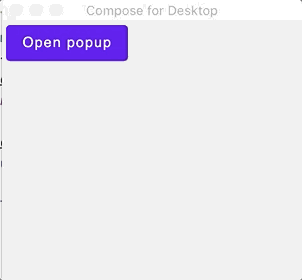

# Keyboard events handling

## Prerequisites

This tutorial expects set and ready Compose project build similar to which is described in [Getting Started tutorial](../Getting_Started)

## KeySets & ShortcutHandler

Compose for Desktop has a few utilities to work with shortcuts:

`KeysSet` represents a simultaneously pressed chord of keys. You can construct a `KeysSet` using Key's extension function:

``` kotlin
Key.CtrlLeft + Key.Enter
```

`ShortcutHandler` accepts `KeysSet` and returns a handler which could be used as a callback for `keyInputFilter`

## Event handlers

There are two different ways how you can handle key events in Compose for Desktop:

- By setting up an event handler based on a focused component
- By setting up an event handler in the scope of the window

## Focus related events

It's working in the same way as in Compose for Android, see for details [API Reference](https://developer.android.com/reference/kotlin/androidx/compose/ui/input/key/package-summary#keyinputfilter)

The most common use case is to define keyboard handlers for active controls like `TextField`. Here is an example:

``` kotlin
import androidx.compose.desktop.Window
import androidx.compose.foundation.Text
import androidx.compose.foundation.layout.Arrangement
import androidx.compose.foundation.layout.Column
import androidx.compose.foundation.layout.fillMaxSize
import androidx.compose.material.MaterialTheme
import androidx.compose.material.TextField
import androidx.compose.runtime.mutableStateOf
import androidx.compose.runtime.remember
import androidx.compose.ui.Modifier
import androidx.compose.ui.input.key.*
import androidx.compose.ui.unit.IntSize
import androidx.compose.ui.unit.dp
import androidx.compose.runtime.getValue
import androidx.compose.runtime.setValue

@OptIn(ExperimentalKeyInput::class)
fun main() = Window(title = "Compose for Desktop", size = IntSize(300, 300)) {
    MaterialTheme {
        var consumedText by remember { mutableStateOf(0) }
        var text by remember { mutableStateOf("") }
        Column(Modifier.fillMaxSize(), Arrangement.spacedBy(5.dp)) {
            Text("Consumed text: $consumedText")
            TextField(
                    value = text,
                    onValueChange = { text = it },
                    modifier = Modifier.keyInputFilter(
                            ShortcutHandler(Key.CtrlLeft + Key.Enter) {
                                consumedText += text.length
                                text = ""
                            }
                    )
            )
        }
    }
}
```


Note an annotation `@OptIn(ExperimentalKeyInput::class)`. Keyboard-related event handlers are a still-experimental feature of Compose and API changes are possible, so it requires it to use special annotation to emphasize the experimental nature of the code.


## Window-scoped events

`AppWindow` instances have `keyboard` property. Using it, it's possible to define keyboard shortcuts that are always active for the current window. See an example:

``` kotlin
import androidx.compose.desktop.AppWindow
import androidx.compose.desktop.Window
import androidx.compose.foundation.Text
import androidx.compose.foundation.layout.Arrangement
import androidx.compose.foundation.layout.Column
import androidx.compose.foundation.layout.fillMaxSize
import androidx.compose.foundation.layout.padding
import androidx.compose.material.Button
import androidx.compose.material.MaterialTheme
import androidx.compose.ui.Modifier
import androidx.compose.ui.input.key.ExperimentalKeyInput
import androidx.compose.ui.input.key.Key
import androidx.compose.ui.unit.IntSize
import androidx.compose.ui.unit.dp

@OptIn(ExperimentalKeyInput::class)
fun main() = Window(title = "Compose for Desktop", size = IntSize(300, 300)) {
    MaterialTheme {
        Column(Modifier.fillMaxSize(), Arrangement.spacedBy(5.dp)) {
            Button(
                    modifier = Modifier.padding(4.dp),
                    onClick = {
                        AppWindow(size = IntSize(200, 200)).also {
                            it.keyboard.shortcut(Key.Escape) {
                                it.close()
                            }
                        }.show {
                            Text("I'm popup!")
                        }
                    }
            ) {
                Text("Open popup")
            }
        }
    }
}
```


