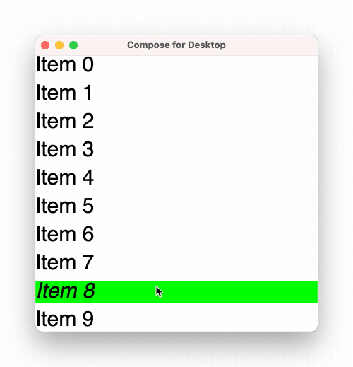

# Getting Started with Compose for Desktop

## What is covered

In this tutorial we will see how to install mouse event listeners on components
in Compose for Desktop.

## Mouse event listeners

### Click listeners

Click listeners are available in both Compose on Android and Compose for Desktop,
so code like this will work on both platforms:

```kotlin
import androidx.compose.desktop.Window
import androidx.compose.foundation.background
import androidx.compose.foundation.clickable
import androidx.compose.foundation.layout.*
import androidx.compose.material.Text
import androidx.compose.runtime.mutableStateOf
import androidx.compose.runtime.remember
import androidx.compose.ui.Alignment
import androidx.compose.ui.Modifier
import androidx.compose.ui.graphics.Color
import androidx.compose.ui.unit.IntSize
import androidx.compose.ui.unit.sp

fun main() = Window(title = "Compose for Desktop", size = IntSize(400, 400)) {
    var count = remember { mutableStateOf(0) }
    Box(contentAlignment = Alignment.Center, modifier = Modifier.fillMaxWidth()) {
        var text = remember { mutableStateOf("Click magenta box!") }
        Column {
            Box(
                modifier = Modifier
                    .background(Color.Magenta)
                    .fillMaxWidth(0.7f)
                    .fillMaxHeight(0.2f)
                    .clickable(
                        onClick = {
                            text.value = "Click! ${count.value++}"
                        },
                        onDoubleClick = {
                            text.value = "Double click! ${count.value++}"
                        },
                        onLongClick = {
                            text.value = "Long click! ${count.value++}"
                        }
                    )
            )
            Text(text = text.value, fontSize = 40.sp)
        }
    }
}
```


### Mouse move listeners

As typically mouse and other positional pointers are only available on desktop platforms,
the following code will only work with Compose for Desktop.
Let's create a window and install a pointer move filter on it that changes the background
color according to the mouse pointer position:
```kotlin
import androidx.compose.desktop.Window
import androidx.compose.foundation.background
import androidx.compose.foundation.layout.*
import androidx.compose.runtime.mutableStateOf
import androidx.compose.runtime.remember
import androidx.compose.ui.Alignment
import androidx.compose.ui.Modifier
import androidx.compose.ui.graphics.Color
import androidx.compose.ui.input.pointer.pointerMoveFilter
import androidx.compose.ui.unit.IntSize

fun main() = Window(title = "Compose for Desktop", size = IntSize(400, 400)) {
    var color = remember { mutableStateOf(Color(0, 0, 0)) }
    Box(
            modifier = Modifier
                    .wrapContentSize(Alignment.Center)
                    .fillMaxSize()
                    .background(color = color.value)
                    .pointerMoveFilter(
                            onMove = {
                                color.value = Color(it.x.toInt() % 256, it.y.toInt() % 256, 0)
                                false
                            }
                    )
    )
}
```


### Mouse enter listeners

Compose for Desktop also supports pointer enter and exit handlers, like this:
```kotlin
import androidx.compose.desktop.Window
import androidx.compose.foundation.background
import androidx.compose.foundation.layout.*
import androidx.compose.material.Text
import androidx.compose.runtime.mutableStateOf
import androidx.compose.runtime.remember
import androidx.compose.ui.Modifier
import androidx.compose.ui.graphics.Color
import androidx.compose.ui.input.pointer.pointerMoveFilter
import androidx.compose.ui.text.font.FontStyle
import androidx.compose.ui.unit.IntSize
import androidx.compose.ui.unit.dp
import androidx.compose.ui.unit.sp

fun main() = Window(title = "Compose for Desktop", size = IntSize(400, 400)) {
    Column(verticalArrangement = Arrangement.spacedBy(10.dp)) {
        repeat(10) { index ->
            var active = remember { mutableStateOf(false) }
            Text(
                modifier = Modifier
                    .fillMaxWidth()
                    .background(color = if (active.value) Color.Green else Color.White)
                    .pointerMoveFilter(
                        onEnter = {
                            active.value = true
                            false
                        },
                        onExit = {
                            active.value = false
                            false
                        }
                    ),
                fontSize = 30.sp,
                fontStyle = if (active.value) FontStyle.Italic else FontStyle.Normal,
                text = "Item $index"
            )
        }
    }
}
```
