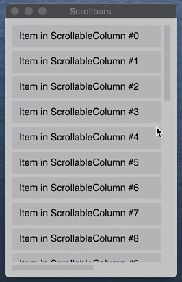

# Scrollbar usage

## What is covered

In this tutorial, we will show you how to add scrollbars to scrollable lists using Compose for Desktop.

## Scrollbars applying

You can apply scrollbars to scrollable components. The scrollbar and scrollable components share a common state to synchronize with each other. For example, VerticalScrollbar can be attached to ScrollableColumn, and LazyColumnFor and HorizontalScrollbar can be attached to ScrollableRow and LazyRowFor.

```kotlin
import androidx.compose.desktop.Window
import androidx.compose.foundation.background
import androidx.compose.foundation.HorizontalScrollbar
import androidx.compose.foundation.layout.Box
import androidx.compose.foundation.layout.Column
import androidx.compose.foundation.layout.fillMaxHeight
import androidx.compose.foundation.layout.fillMaxWidth
import androidx.compose.foundation.layout.fillMaxSize
import androidx.compose.foundation.layout.height
import androidx.compose.foundation.layout.padding
import androidx.compose.foundation.layout.Spacer
import androidx.compose.foundation.layout.width
import androidx.compose.foundation.rememberScrollbarAdapter
import androidx.compose.foundation.rememberScrollState
import androidx.compose.foundation.ScrollableColumn
import androidx.compose.foundation.ScrollableRow
import androidx.compose.foundation.Text
import androidx.compose.foundation.VerticalScrollbar
import androidx.compose.runtime.Composable
import androidx.compose.ui.Alignment
import androidx.compose.ui.graphics.Color
import androidx.compose.ui.Modifier
import androidx.compose.ui.unit.dp
import androidx.compose.ui.unit.IntSize

fun main() {
    Window(title = "Scrollbars", size = IntSize(250, 400)) {
        Box(
            modifier = Modifier.fillMaxSize()
                .background(color = Color(180, 180, 180))
                .padding(10.dp)
        ) {
            val stateVertical = rememberScrollState(0f)
            val stateHorizontal = rememberScrollState(0f)

            ScrollableColumn(
                modifier = Modifier.fillMaxSize()
                    .padding(end = 12.dp, bottom = 12.dp),
                scrollState = stateVertical
            ) {
                ScrollableRow(scrollState = stateHorizontal) {
                    Column {
                        for (item in 0..30) {
                            TextBox("Item in ScrollableColumn #$item")
                            if (item < 30) {
                                Spacer(modifier = Modifier.height(5.dp))
                            }
                        }
                    }
                }
            }
            VerticalScrollbar(
                modifier = Modifier.align(Alignment.CenterEnd)
                    .fillMaxHeight(),
                adapter = rememberScrollbarAdapter(stateVertical)
            )
            HorizontalScrollbar(
                modifier = Modifier.align(Alignment.BottomStart)
                    .fillMaxWidth()
                    .padding(end = 12.dp),
                adapter = rememberScrollbarAdapter(stateHorizontal)
            )
        }
    }
}

@Composable
fun TextBox(text: String = "Item") {
    Box(
        modifier = Modifier.height(32.dp)
            .width(400.dp)
            .background(color = Color(0, 0, 0, 20))
            .padding(start = 10.dp),
        alignment = Alignment.CenterStart
    ) {
        Text(text = text)
    }
}
```



## Lazy scrollable components with Scrollbar

You can use scrollbars with lazy scrollable components, for example, LazyColumn.

```kotlin
import androidx.compose.desktop.Window
import androidx.compose.foundation.background
import androidx.compose.foundation.ExperimentalFoundationApi
import androidx.compose.foundation.layout.Box
import androidx.compose.foundation.layout.fillMaxHeight
import androidx.compose.foundation.layout.fillMaxSize
import androidx.compose.foundation.layout.height
import androidx.compose.foundation.layout.padding
import androidx.compose.foundation.layout.Spacer
import androidx.compose.foundation.lazy.ExperimentalLazyDsl
import androidx.compose.foundation.lazy.LazyColumn
import androidx.compose.foundation.lazy.rememberLazyListState
import androidx.compose.foundation.rememberScrollbarAdapter
import androidx.compose.foundation.Text
import androidx.compose.foundation.VerticalScrollbar
import androidx.compose.runtime.Composable
import androidx.compose.ui.Alignment
import androidx.compose.ui.graphics.Color
import androidx.compose.ui.Modifier
import androidx.compose.ui.unit.dp
import androidx.compose.ui.unit.IntSize

fun main() {
    Window(title = "Scrollbars", size = IntSize(250, 400)) {
        LazyScrollable()
    }
}

@OptIn(ExperimentalLazyDsl::class, ExperimentalFoundationApi::class)
@Composable
fun LazyScrollable() {
    Box(
        modifier = Modifier.fillMaxSize()
            .background(color = Color(180, 180, 180))
            .padding(10.dp)
        ) {

        val state = rememberLazyListState()
        val itemCount = 1000

        LazyColumn(Modifier.fillMaxSize().padding(end = 12.dp), state) {
            items((1..itemCount).toList()) { x ->
                TextBox("Item in ScrollableColumn #$x")
                Spacer(modifier = Modifier.height(5.dp))
            }
        }
        VerticalScrollbar(
            modifier = Modifier.align(Alignment.CenterEnd).fillMaxHeight(),
            adapter = rememberScrollbarAdapter(
                scrollState = state,
                itemCount = itemCount,
                averageItemSize = 37.dp // TextBox height + Spacer height
            )
        )
    }
}

@Composable
fun TextBox(text: String = "Item") {
    Box(
        modifier = Modifier.height(32.dp)
            .fillMaxWidth()
            .background(color = Color(0, 0, 0, 20))
            .padding(start = 10.dp),
        alignment = Alignment.CenterStart
    ) {
        Text(text = text)
    }
}
```


## Theme applying

Scrollbars support themes to change their appearance. The example below shows how to use the DesktopTheme appearance for the scrollbar.

```kotlin
import androidx.compose.desktop.DesktopTheme
import androidx.compose.desktop.Window
import androidx.compose.foundation.background
import androidx.compose.foundation.layout.Box
import androidx.compose.foundation.layout.fillMaxHeight
import androidx.compose.foundation.layout.fillMaxWidth
import androidx.compose.foundation.layout.fillMaxSize
import androidx.compose.foundation.layout.height
import androidx.compose.foundation.layout.padding
import androidx.compose.foundation.layout.Spacer
import androidx.compose.foundation.layout.width
import androidx.compose.foundation.rememberScrollbarAdapter
import androidx.compose.foundation.rememberScrollState
import androidx.compose.foundation.ScrollableColumn
import androidx.compose.foundation.Text
import androidx.compose.foundation.VerticalScrollbar
import androidx.compose.material.MaterialTheme
import androidx.compose.runtime.Composable
import androidx.compose.ui.Alignment
import androidx.compose.ui.graphics.Color
import androidx.compose.ui.Modifier
import androidx.compose.ui.unit.dp
import androidx.compose.ui.unit.IntSize

fun main() {
    Window(title = "Scrollbars", size = IntSize(280, 400)) {
        MaterialTheme {
            DesktopTheme {
                Box(
                    modifier = Modifier.fillMaxSize()
                        .background(color = Color(180, 180, 180))
                        .padding(10.dp)
                ) {
                    val state = rememberScrollState(0f)
        
                    ScrollableColumn(
                        modifier = Modifier.fillMaxSize().padding(end = 12.dp),
                        scrollState = state
                    ) {
                        for (item in 0..30) {
                            TextBox("Item in ScrollableColumn #$item")
                            if (item < 30) {
                                Spacer(modifier = Modifier.height(5.dp))
                            }
                        }
                    }
                    VerticalScrollbar(
                        modifier = Modifier.align(Alignment.CenterEnd)
                            .fillMaxHeight(),
                        adapter = rememberScrollbarAdapter(state)
                    )
                }
            }
        }
    }
}

@Composable
fun TextBox(text: String = "Item") {
    Box(
        modifier = Modifier.height(32.dp)
            .fillMaxWidth()
            .background(color = Color(0, 0, 0, 20))
            .padding(start = 10.dp),
        alignment = Alignment.CenterStart
    ) {
        Text(text = text)
    }
}
```


